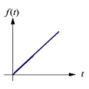
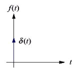
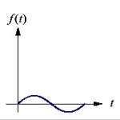

# Control systems

<!-- omit in toc -->
## Table of contents
- [Linear systems](#linear-systems)
  - [Superposition principle](#superposition-principle)
  - [Linearity](#linearity)
  - [Time invariance](#time-invariance)
  - [Convolution](#convolution)
  - [Impulse response](#impulse-response)
  - [Linear time invariant systems](#linear-time-invariant-systems)
  - [Causal systems](#causal-systems)
  - [Complex numbers](#complex-numbers)
  - [Frequency domain](#frequency-domain)
  - [Laplace transform](#laplace-transform)
  - [Convolution theorem](#convolution-theorem)
  - [Transfer function](#transfer-function)
- [Typical inputs](#typical-inputs)
  - [Step input](#step-input)
  - [Ramp input](#ramp-input)
  - [Impulse input](#impulse-input)
  - [Harmonic input](#harmonic-input)
- [Control Systems](#control-systems-1)
  - [Definition](#definition)
  - [System configurations](#system-configurations)
    - [Open loop systems](#open-loop-systems)
    - [Closed loop systems](#closed-loop-systems)

## Linear systems

### Superposition principle

A system satisfies the superposition principle, if the net response caused by two or more stimuli is the sum of the responses that would have been caused by each stimuli individually. Superposition can be defined by two simpler properties:

$$
\begin{equation}
\tag{Additivity}
F(x_1 + x_2) = F(x_1) + F(x_2)
\end{equation}
$$

$$
\begin{equation}
\tag{Homogeneity}
F(\alpha x) = \alpha F(x)
\end{equation}
$$

### Linearity

A system is considered linear if it satisfies the superposition principle. In a linear system, if input $u_1$ produces response $y_1$ and input $u_2$ produces response $y_2$, then the weighted sum of these inputs must produce the weighted sum of these responses.

$$
\begin{equation}
\tag{Linearity}
\alpha_1 y_1(t) + \alpha_2 y_2(t) = F(\alpha_1 u_1(t) + \alpha_2 u_2(t))
\end{equation}
$$

Generally, any system described by a differential equation of the following form is linear, with $n \geq m$.

$$
a_n \frac {d^n}{dt^n} y(t) + a_{n - 1} \frac {d^{n - 1}}{dt^{n - 1}} y(t) + \dots + a_0 y(t) = b_m \frac {d^m}{dt^m} x(t) + b_{m - 1} \frac {d^{m - 1}}{dt^{m - 1}} x(t) + \dots + b_0 x(t)
$$

### Time invariance

A system is considered time-invariant, given it has a time-dependent output function $y(t)$ and a time-dependent input function $u(t)$, if a time delay on the input function $u(t - \tau)$ directly equates to a time delay on the output function $y(t - \tau)$. In other words, if the input to the system is applied $\tau$ time units later, the output will be identical except for the equivalent time delay.

$$
\begin{equation}
\tag{Time invariance}
y(t - \tau) = F(u(t - \tau))
\end{equation}
$$

### Convolution

The convolution $f \ast g$ is defined as the integral of the product of the two functions after one is reflected about the y-axis and shifted.

$$
\begin{equation}
\tag{Convolution}
\begin{aligned}
(f \ast g)(t) &= \int^{\infty}_{-\infty} f(t - \tau) g(\tau) d\tau \\
              &= \int^{\infty}_{-\infty} f(\tau) g(t - \tau) d\tau
\end{aligned}
\end{equation}
$$

### Impulse response

The impulse response $h(t)$ of a system is its output when presented with a brief input signal called a *unit impulse*. A unit impulse $\delta(t)$ is a function whose value is zero everywhere except at zero, and whose integral over the entire real line is equal to one.

$$
\begin{equation}
\tag{Impulse response}
h(t) = F(\delta(t))
\end{equation}
$$

The convolution of the unit impulse function with another function $f(t)$ is simply $f(t)$.

$$
(\delta \ast f)(t) = \int^{\infty}_{-\infty} f(\tau) \delta(t - \tau) d\tau = f(t)
$$

### Linear time invariant systems

Linear, time-invariant (LTI) systems are systems that are both linear and time-invariant. LTI systems are of special interest because they can be characterized entirely by a single function called the *impulse response*. Once the impulse response is known for an LTI system, responses to all inputs can be found.

The output function $y(t)$ is the convolution of the input function $x(t)$ with the impulse response $h(t)$.

$$
\begin{aligned}
y(t) &= \int^{\infty}_{-\infty} u(\tau) h(t - \tau) d\tau \\
     &= h(t) \ast u(t)
\end{aligned}
$$

### Causal systems

A causal system is a system where the output depends on past and current inputs but not future inputs. The integral for the output function $y(t)$ of an LTI system can hence be modified so that the upper limit is $t$.

$$
\begin{aligned}
y(t) &= \int^{\infty}_{-\infty} u(\tau) h(t - \tau) d\tau \\
     &= \int^{t}_{-\infty} u(\tau) h(t - \tau) d\tau
\end{aligned}
$$

All physical systems respond to input only after the input is applied. In math terms, this means that $u(t) = 0$ and $h(t) = 0$ for all $t < 0$.

$$
\begin{aligned}
y(t) &= \int^{t}_{-\infty} u(\tau) h(t - \tau) d\tau \\
     &= \int^{t}_{0} u(\tau) h(t - \tau) d\tau
\end{aligned}
$$

### Complex numbers

A complex number is a number of the form $z = x + \iota y$, where $x$ and $y$ are real numbers, and $i$ is an indeterminate called the *imaginary unit* and satisfies $\iota ^2 = -1$.

The *argument* $\theta$ of a complex number $z$ is the polar angle from the positive real axis to the vector representing $z$ in the complex plane.

$$
\theta = \arg (z) = -\iota \ln{\frac{z}{|z|}}
$$

If the complex number $z$ lies to the right imaginary axis in the complex plane; $x > 0$:

$$
\theta = \arg (x + \iota y) = \arctan{\frac{y}{x}}
$$

The *modulus* $r$ of a complex number $z$ is the Euclidean distance from the origin to the point representing $z$ in the complex plane.

$$
r = |z| = \sqrt{x^2 + y^2}
$$

Euler's formula establishes the fundamental relationship between the complex exponential function and trigonometric functions. Euler's formula states that for any real number $\theta$:

$$
\begin{equation}
\tag{Euler's formula}
\cos{\theta} + \iota \sin{\theta} = e^{\iota \theta}
\end{equation}
$$

Euler's formula allows to alternate between *rectangular form* ($z = x + \iota y$) and *polar form* ($z = |z| \angle \arg (z)$).

$$
r (\cos{\theta} + \iota \sin{\theta}) = r e^{\iota \theta}
$$

Arithmetic rules for two complex numbers $z_1$ and $z_2$ are given below. Note that addition and subtraction are more naturally expressed in rectangular form, and multiplication and division are more cleanly expressed in polar form.

$$
\begin{aligned}
z_1 + z_2 &= (x_1 + x_2) + i (y_1 + y_2) \\
z_1 - z_2 &= (x_1 - x_2) + i (y_1 - y_2) \\
z_1 \times z_2 &= |z_1| |z_2| \angle \arg (z_1) + \arg (z_2) \\
z_1 \div z_2 &= \frac{|z_1|}{|z_2|} \angle \arg (z_1) - \arg (z_2)
\end{aligned}
$$

### Frequency domain

The frequency domain refers to the analysis of functions or signals with respect to frequency rather than time. A time domain graph shows how a signal changes over time, whereas a frequency domain graph shows how much of the signal lies within each given frequency band over a range of frequencies.

For systems described by linear differential equations, converting the system from time domain to frequency domain converts the differential equations to algebraic equations, which are much easier to solve.

### Laplace transform

The Laplace transform is an integral transform that converts a function of a real variable in the time domain to a function of a complex variable in the frequency domain. It transforms ordinary differential equations into algebraic equations and convolution into multiplication.

The Laplace transform of a function $y(t)$ is defined for all real numbers $t \geq 0$ as $Y(s)$, where $s = \sigma + \iota \omega$.

$$
\begin{equation}
\tag{Laplace transform}
Y(s) = \mathcal{L} \lbrace y(t) \rbrace = \int^{\infty}_{0} y(t) e^{-st} dt
\end{equation}
$$

### Convolution theorem

The convolution theorem states that the Laplace transform of a convolution of two functions is the pointwise product of their Laplace transforms. For an LTI system with impulse response $h(t)$, input signal $x(t)$, and output response $y(t)$, the convolution theorem implies:

$$
\begin{equation}
\tag{Convolution theorem}
y(t) = h(t) \ast x(t) \iff Y(s) = H(s) X(s)
\end{equation}
$$

### Transfer function

The transfer function $H(s)$ of an LTI system is a mathematical function that theoretically models the system's output for each possible input. Thus, the transfer function $H(s)$ is the linear mapping of the Laplace transform of the input, $X(s) = \mathcal{L} \lbrace x(t) \rbrace$, to the Laplace transform of the output, $Y(s) = \mathcal{L} \lbrace y(t) \rbrace$:

$$
\begin{equation}
\tag{Transfer function}
H(s) = \frac{Y(s)}{X(s)}
\end{equation}
$$

For an LTI system described an ordinary differential equation, with input signal $x(t)$ and output response $y(t)$, the impulse response $h(t)$ can be written symbolically using the *differential operator $D$* ($D^n = \frac{d^n}{dt^n}$).

$$
\begin{aligned}
a_n \frac {d^n}{dt^n} y(t) + a_{n - 1} \frac {d^{n - 1}}{dt^{n - 1}} y(t) + \dots + a_0 y(t) &= b_m \frac {d^m}{dt^m} x(t) + b_{m - 1} \frac {d^{m - 1}}{dt^{m - 1}} x(t) + \dots + b_0 x(t) \\[10pt]
h(t) = \frac{y(t)}{x(t)} &= \frac{a_n D^n + a_{n - 1} D^{n - 1} + \dots + a_0}{b_m D^m + b_{m - 1} D^{m - 1} + \dots + b_0}
\end{aligned}
$$

The transfer function $H(s)$ is obtained by applying Laplace transform to the differential equations describing the system ($\mathcal{L}\lbrace\frac{d^n}{dt^n}f(t)\rbrace = s^n F(s)$), assuming zero initial conditions.

$$
\begin{aligned}
a_n s^n Y(s) + a_{n - 1} s^{n - 1} Y(s) + \dots + a_0 Y(s) &= b_m s^m X(s) + b_{m - 1} s^{m - 1} X(s) + \dots + b_0 X(s) \\[10pt]
H(s) = \frac{Y(s)}{X(x)} &= \frac{a_n s^n + a_{n - 1} s^{n - 1} + \dots + a_0}{b_m s^m + b_{m - 1} s^{m - 1} + \dots + b_0}
\end{aligned}
$$

## Typical inputs

Dynamic systems respond to initial conditions and input signals. The response to initial conditions displays the basic inherent dynamic behavior of the system, and the response to input signals displays the response character of the system to forced inputs that emulate physically realistic conditions.

### Step input

In physical systems, the input can be changed suddenly. Ideally in these instances, the input signal has zero rise time relative to the dynamic response time of the system.

| Input | Function | Description | Sketch |
| - | - | - | - |
| Step | $u(t)$ | $\begin{aligned} u(t) = \begin{cases} 0 & t < 0\\ u_0 & t \geq 0 \end{cases} \end{aligned}$ |  |

However, in real systems, the input is changed by some other dynamic system with a finite response time. Therefore, the input signal does not have zero rise time relative to the dynamic response time of the system.

In these instances, the input signal is modelled as a *ramped step input*, where the input rises like a ramp for some time, and stays constant thereafter.

$$
\begin{aligned}
u(t) =
\begin{cases}
0 & t < 0 \\
u_0 \frac{t}{T_1} & 0 \leq t \leq T_1 \\
u_0 & t > T_1
\end{cases}
\end{aligned}
$$

### Ramp input

In physical systems, the input can rise constantly from zero. Ideally in these instances, the input signal increases as a linear function of time. This ramp signal can be considered the integral of the step signal.

| Input | Function | Description | Sketch |
| - | - | - | - |
| Ramp | $tu(t)$ | $\begin{aligned} tu(t) = \begin{cases} 0 & t < 0\\ u_0 t & t \geq 0 \end{cases} \end{aligned}$ |  |

However, in real systems, the input signal can not keep rising forever, since energy is a finite resource. In these instances, the input signal is modelled as a *sawtooth wave*, where the input rises like a ramp for some time, falls to zero, and rises again.

### Impulse input

The derivative of the step function is called the *impulse input*. An impulse input $\delta(t)$ is a function whose value is zero everywhere except at zero, and whose integral over the entire real line is equal to some constant.

| Input | Function | Description | Sketch |
| - | - | - | - |
| Impulse | $\delta(t)$ | $\begin{aligned} \delta(t) = \begin{cases} 0 & t \not= 0\\ \infty & t = 0 \end{cases} \end{aligned} \\ \int^{0^+}_{0^-}{\delta(t)}dt = u_0$ |  |

However, in real systems, the input signal can not be a pure impulse signal, since that requires an infinite value of the input variable for zero duration of time. In these instances, the input is modelled as a *pulse input*, where the input is constant at some finite value for some finite nonzero duration of time.

The pulse input can be considered an impulse signal if the duration is very small compared to the dynamic response time of the system.

$$
\begin{aligned}
u(t) =
\begin{cases}
0 & t > 0 \text{ or } t > T_1 \\
u_0 & 0 \leq t \leq T_1
\end{cases}
\end{aligned}
$$

### Harmonic input

In physical systems, the input can oscillate at some amplitude. These sinusoidal waves are used to test for the system's *frequency response*, which describes how the system will respond to sinusoidal waves of various frequencies.

If the system's *transient response* is to be tested, the input signal would be zero and the sinusoidal wave would start at $t = 0$.

| Input | Function | Description | Sketch |
| - | - | - | - |
| Sinusoidal | $\sin{\omega t}$ | $\begin{aligned} \sin{\omega t} = \begin{cases} 0 & t < 0 \\ u_0 \sin{\omega t} & t \geq 0\end{cases} \end{aligned}$ |  |

If the system's *steady state response* is to be tested, the input signal would be provided to the system for some time duration, and the system response would be observed after the transients have died away.

## Control Systems

### Definition

A *control system* consists of *subsystems* and *processes* (or *plants*) assembled for the purpose of obtaining a *desired output* with *desired performance*, given a *specified input*.

Control systems have the following advantages:

- Power amplification
- Remote control
- Convenience of input form
- Compensation for disturbances

### System configurations

There are two major configurations of control systems: *open loop* and *closed loop*.

#### Open loop systems

The generic architecture of an open loop system is shown in the figure below. It starts with a subsystem called an *input transducer*, which converts the form of input to that used by the *controller*. The controller drives a *process* or *plant*. The input is sometimes called the *reference*, while the output can be called the *controller variable*. Other signals, such as *disturbances*, are shown added to the controller and process outputs via *summing junctions*, which yield the algebraic sum of their input signals using associated signs.

The distinguishing characteristic of an open loop system is that it can not compensate for any disturbances that add to the controller's driving signal (Disturbance 1 in the figure). The output of an open loop system is corrupted not only by signals that add to the controller's commands but also by disturbances at the output ("Disturbance 2 in the figure). The system can not correct these disturbances either.

#### Closed loop systems

The generic architecture of a closed loop system in shown in the figure below. The input transducer converts the form of input to the form used by the controller. An *output transducer*, or *sensor*, measures the output response and converts it into the form used by the controller.

The first summing junction algebraically adds the signal from the input to the signal from the output, which arrives via the *feedback path*, the return path from the output to the summing junction. The result is generally called the *actuating signal*. However, in systems where both the input and output transducers have *unity gain* (that is, the transducer amplifies the input by 1), the actuating signal's value is equal to the actual difference between the input and the output. Under this condition, the actuating signal is called the *error*.

The closed loop system compensates for disturbances by measuring the output response, feeding that measurement back through a feedback path, and comparing that response to the input at the summing junction.
